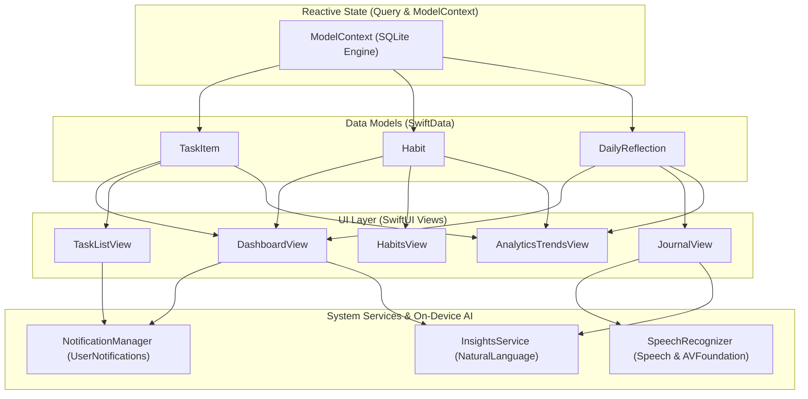

# MyDay 

> **A native, local-first iOS lifestyle companion engineered with SwiftUI, SwiftData, UserNotifications, and Apple's on-device NaturalLanguage framework.**

[](https://developer.apple.com/ios/)
[](https://swift.org/)
[](https://developer.apple.com/xcode/swiftui/)
[](https://developer.apple.com/documentation/swiftdata)
[](#privacy--local-first-design)

---

##  Overview

**MyDay** is designed to bridge intentional daily planning with mindful self-reflection. Rather than treating to-do lists, habit trackers, and journals as fragmented utilities, MyDay unifies them into a cohesive **daily command center** that adapts to your routine and provides privacy-preserving on-device lifestyle intelligence.

Built entirely with Apple's first-party modern frameworks, MyDay adheres strictly to Apple's **Human Interface Guidelines (HIG)** and requires **zero external cloud servers, zero API keys, and zero user data collection**.

---

##  Key Features include:

### 1. Unified "Today" Dashboard
- **Dynamic Context-Aware Greetings:** Adapts dynamically to morning, afternoon, and evening with corresponding iconography and formatted calendar dates.
- **Daily Momentum Ring:** Aggregates habits checked, focus tasks completed, and mindfulness check-in status into a real-time progress indicator.
- **Habits Quick-Strip:** Horizontal carousel providing 1-tap check-in with spring physics and responsive sensory haptics.
- **Focus Tasks:** Surfaces top pending items due today with inline strikethrough completion toggles.
- **Mood & Reflection Snapshot:** Displays daily emotional highlights or provides a 1-tap prompt to log feelings.

### 2.  Daily Tasks Engine
- Priority-ranked task management (`High`, `Medium`, `Low`) with color-coded capsule badges.
- Native `NavigationStack` with search bar filtering and sectioning (`Pending` vs `Completed`).
- Modal `Form` creation with full date-time scheduling and multi-line notes.
- Native swipe-to-delete and interactive circular checkmarks.

### 3.  Habits & Consistency Engine
- Daily routine builder with custom icon selection (12 curated SF Symbols) and 7 vibrant iOS theme colors.
- Calendar-accurate streak calculation utilizing `Calendar.current.startOfDay` to track unbroken consistency.
- Interactive daily progress card with celebratory motivational states.

### 4.  Mindfulness & Daily Reflection
- Quick emotional check-in with 5 expressive mood states: `😄 Great`, `🙂 Good`, `😐 Neutral`, `😔 Down`, and `😣 Stressed`.
- Multi-select feeling tags (`Grateful`, `Productive`, `Relaxed`, `Energetic`, etc.) with responsive color adaptation.
- Multi-line gratitude journaling using modern `TextField(axis: .vertical)`.
- Reverse-chronological reflection timeline with formatted timestamps.

### 5.  Local Notifications & Reminders
- Background scheduling using Apple's `UserNotifications` framework (`UNUserNotificationCenter`).
- Specific due-date task reminders triggered via `UNCalendarNotificationTrigger`.
- Optional recurring daily evening reflection reminder (e.g., 8:30 PM).
- Automatic cancellation of pending alerts upon task completion or deletion.

### 6.  On-Device AI & Personal Insights
- **Sentiment Analysis:** Utilizes Apple's native `NaturalLanguage` framework (`NLTagger(tagSchemes: [.sentimentScore])`) running directly on Apple Silicon's Neural Engine.
- **Habit-Mood Correlation:** Computes empirical conditional probabilities correlating completed habits with positive mood reports.
- **Streak & Productivity Patterns:** Detects consistency trends and milestone achievements without sending a single byte off-device.

### 7. 🎙️ Apple App Intents & Siri Shortcuts
- **Hands-Free Siri Voice Queries:** Ask *"What's my MyDay momentum?"* for an instant spoken breakdown of your daily progress.
- **Voice Habit Completion:** Say *"Hey Siri, complete habit in MyDay"* to check off habits and hear your updated streak.
- **Hands-Free Task Creation:** Say *"Add task to MyDay"* to quickly capture to-dos with voice dictation.
- **Zero-Config App Shortcuts:** Pre-registers voice phrases via `AppShortcutsProvider` so Siri recognizes them instantly with zero user setup.
- **Apple Shortcuts App & Automations:** Build morning routines, NFC-triggered habit check-ins, or time-based automations.

### 8.  Interactive Visual Analytics with Apple Swift Charts
- **Emotional Trajectory Spline:** `LineMark` + `AreaMark` gradient plotting on-device sentiment valence over time with zero-baseline threshold.
- **Habit Consistency by Weekday:** `BarMark` distribution revealing peak consistency days across Monday through Sunday.
- **Task Velocity Donut:** `SectorMark` visualizing task completions segmented by priority (High, Medium, Low).
- **Time Range Windows:** Switch seamlessly between 7-Day and 30-Day analytical views.

### 9.  On-Device Voice-to-Text Journaling
- **Speech & AVFoundation Engine:** 100% private, on-device audio transcription via `SFSpeechRecognizer` and `AVAudioEngine`.
- **Live Reactive Audio Waveform:** Visual feedback pulsing with microphone RMS audio levels as you speak.
- **Real-Time Sentiment Feedback:** Live AI sentiment badge evaluating emotional tone dynamically as words are transcribed.

---

##  Product & Engineering Documentation

MyDay includes enterprise-grade product and technical specifications developed via reverse engineering:

- [ **Business Requirements Document (BRD)**](docs/BRD.md): Business vision, market differentiation, personas, ROI, and privacy moat.
- [ **Product Requirements Document (PRD)**](docs/PRD.md): End-to-end user journeys, functional requirements (FR-1 through FR-8), and NFRs.
- [ **Software Requirements & Architecture Document (SRD)**](docs/SRD.md): Full technical architecture, SwiftData schema, NaturalLanguage formulas, and concurrency patterns.

---

##  Architecture & Engineering Design

MyDay follows a **Feature-First Model-View (MV) Architecture** optimized for modern SwiftUI and SwiftData:

```text
MyDay/
├── App/
│   └── MyDayApp.swift               # @main entry point, ModelContainer schema setup
├── Models/                          # SwiftData @Model entities & database container
│   ├── AppDatabase.swift            # Centralized thread-safe ModelContainer singleton
│   ├── TaskItem.swift               # Task entity, Priority enum (Codable, Identifiable)
│   ├── Habit.swift                  # Habit entity, streak logic, Calendar operations
│   └── DailyReflection.swift        # Reflection entity, Mood enum, feeling tags
├── Intents/                         # Apple App Intents & Siri Shortcuts
│   ├── HabitEntity.swift            # AppEntity & EntityQuery for dynamic habit voice matching
│   ├── CompleteHabitIntent.swift    # Voice habit completion intent
│   ├── GetDailyMomentumIntent.swift # Voice momentum query intent
│   ├── AddTaskIntent.swift          # Hands-free task capture intent
│   └── MyDayShortcuts.swift         # AppShortcutsProvider registering voice triggers
├── Features/                        # Domain features grouped by functional slice
│   ├── Dashboard/                   # Today command center, settings, insights card & modal
│   │   ├── DashboardView.swift
│   │   ├── InsightsCardView.swift
│   │   ├── InsightsDetailSheet.swift
│   │   └── SettingsSheet.swift
│   ├── Analytics/                   # Apple Swift Charts visual analytics
│   │   └── AnalyticsTrendsView.swift
│   ├── Tasks/                       # Task list, task row, task creation sheet
│   │   ├── TaskListView.swift
│   │   ├── TaskRowView.swift
│   │   └── NewTaskSheet.swift
│   ├── Habits/                      # Habit list, habit card, habit creation sheet
│   │   ├── HabitsView.swift
│   │   ├── HabitRowView.swift
│   │   └── NewHabitSheet.swift
│   └── Journal/                     # Reflection timeline, check-in sheet, card view
│       ├── JournalView.swift
│       ├── NewReflectionSheet.swift
│       └── ReflectionCardView.swift
├── Services/                        # Centralized system & intelligence services
│   ├── NotificationManager.swift    # @MainActor singleton for UserNotifications
│   ├── InsightsService.swift        # NaturalLanguage sentiment & correlation analytics
│   ├── SpeechRecognizer.swift       # On-device Speech & AVFoundation transcription
│   └── BackupService.swift          # JSON serialization & restore service
├── MyDayTests/
│   └── MyDayTests.swift             # Swift Testing suite (streaks, sentiment, intents, charts)
├── MyDayWidget/
│   └── MyDayWidget.swift            # WidgetKit TimelineProvider and widget views
└── docs/
    ├── BRD.md                       # Business Requirements Document
    ├── PRD.md                       # Product Requirements Document
    └── SRD.md                       # Software Requirements Document
```

### Data Flow Diagram



---

##  Privacy & Local-First Design

In an era of cloud-hosted analytics and invasive telemetry, **MyDay is fundamentally offline-first**:

- **No Remote Servers:** All user data is stored locally in the app's sandboxed SQLite database via SwiftData.
- **No Third-Party SDKs:** Built with 0 external CocoaPods, SPM packages, or trackers.
- **On-Device Machine Learning:** Sentiment evaluation and lifestyle correlation models run entirely on Apple's Neural Engine.
- **Local Alarms:** Notifications are managed by the iOS kernel daemon (`usernotificationsd`), requiring no APNs server certificates.

---

##  Tech Stack & Requirements

| Specification | Requirement |
| :--- | :--- |
| **Platform** | iOS 17.0+ / iPadOS 17.0+ |
| **Language** | Swift 6.0 |
| **UI Framework** | SwiftUI (Declarative) |
| **Persistence** | SwiftData (Schema-driven SQLite) |
| **Machine Learning** | Apple `NaturalLanguage` (`NLTagger`) |
| **System Frameworks** | `UserNotifications`, `Combine` |
| **IDE** | Xcode 16.0+ |

---

## 🏁 Getting Started

1. **Clone the repository:**
   ```bash
   git clone https://github.com/aryan-patil21/MyDay-iOS.git
   cd MyDay-iOS/MyDay
   ```

2. **Open in Xcode:**
   ```bash
   open MyDay.xcodeproj
   ```

3. **Select a Target & Run:**
   - Choose any **iOS Simulator** (e.g. iPhone 16) or a connected physical iOS device.
   - Press **Cmd + R** to build and run.

---

##  Author

**Aryan Patil**  
*Bachelor's Student in Artificial Intelligence & Data Science*  
- GitHub: [@aryan-patil21](https://github.com/aryan-patil21)
- Project: [MyDay-iOS](https://github.com/aryan-patil21/MyDay-iOS)

---

## 📄 License

This project is licensed under the MIT License - see the [LICENSE](LICENSE) file for details.
