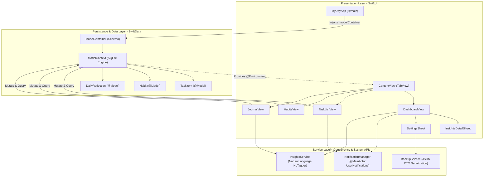

# Software Requirements & System Architecture Document (SRD)
## Project Name: MyDay — Native iOS Lifestyle & Personal Intelligence

---

### Document Control
- **Document Version:** 1.0.0
- **Author & Architect:** Aryan Patil (AI & Data Science)
- **Target Platform:** iOS 17.0+ / iPadOS 17.0+ (Universal)
- **Toolchain:** Xcode 16.0+, Swift 6.0, SwiftData, SwiftUI
- **Status:** Complete Technical Specification

---

## 1. System Architecture & Design Philosophy

MyDay utilizes a modern **Feature-First Model-View (MV) Architecture** tailored specifically for SwiftData and SwiftUI.



### 1.1 Key Design Principles
1. **Unidirectional Reactive Data Flow:** Views subscribe declaratively to model collections via `@Query`. Any insertion, update, or deletion in the `ModelContext` automatically triggers view diffing without imperative notification observers or event buses.
2. **Feature-First Modularity:** Code is grouped by functional domains (`Features/Dashboard`, `Features/Tasks`, `Features/Habits`, `Features/Journal`) rather than technical archetypes. This enables independent scaling as new capabilities are added.
3. **Thread Safety via `@MainActor`:** Classes driving UI state (`NotificationManager`) are annotated with `@MainActor`, enforcing compile-time validation that property mutations occur strictly on the main thread.
4. **Zero-Overhead Abstractions:** Eliminates redundant ViewModel boilerplate. In SwiftData, models are reference types conforming to `Observable`, allowing views to bind directly to `@Model` properties.

---

## 2. Directory Structure & File Taxonomy

```text
MyDay/
├── App/
│   └── MyDayApp.swift                     # App lifecycle, @main, ModelContainer schema
├── Models/                                # SwiftData entities & business enums
│   ├── TaskItem.swift                     # Task schema, Priority enum
│   ├── Habit.swift                        # Habit schema, streak algorithm, calendar logic
│   └── DailyReflection.swift              # Reflection schema, Mood enum, feeling tags
├── Features/                              # Domain-specific UI screens & components
│   ├── Dashboard/
│   │   ├── DashboardView.swift            # Root today dashboard screen
│   │   ├── InsightsCardView.swift         # AI Insights preview component
│   │   ├── InsightsDetailSheet.swift      # Comprehensive analytics modal
│   │   └── SettingsSheet.swift            # Preferences, notifications & backup sheet
│   ├── Tasks/
│   │   ├── TaskListView.swift             # Sectioned task list screen
│   │   ├── TaskRowView.swift              # Task row with interactive checkbox
│   │   └── NewTaskSheet.swift             # Task creation form sheet
│   ├── Habits/
│   │   ├── HabitsView.swift               # Habit list & progress header
│   │   ├── HabitRowView.swift             # Habit card with streak counter
│   │   └── NewHabitSheet.swift            # Habit creator with icon & color grid
│   └── Journal/
│       ├── JournalView.swift              # Timeline reflection screen
│       ├── ReflectionCardView.swift       # Reflection card with mood pill
│       └── NewReflectionSheet.swift       # Mood check-in modal sheet
├── Services/                              # Core system & intelligence engines
│   ├── NotificationManager.swift          # UserNotifications manager
│   ├── InsightsService.swift              # NaturalLanguage sentiment & correlation service
│   └── BackupService.swift                # Portable JSON serialization & restore service
├── Assets.xcassets/                       # 1024x1024 AppIcon and system color palettes
├── MyDayTests/
│   └── MyDayTests.swift                   # Swift Testing suite (streaks, sentiment, math)
├── MyDayWidget/
│   └── MyDayWidget.swift                  # WidgetKit TimelineProvider and widget views
└── docs/
    ├── BRD.md                             # Business Requirements Document
    ├── PRD.md                             # Product Requirements Document
    └── SRD.md                             # Software Requirements Document
```

---

## 3. Data Models & Schema Specification

### 3.1 `TaskItem` Entity
```swift
@Model
final class TaskItem {
    var id: UUID
    var title: String
    var notes: String
    var dueDate: Date
    var isCompleted: Bool
    var priority: Priority
    var createdAt: Date
}
```
- **Enum `Priority`:** `String, Codable, CaseIterable, Identifiable` (`low = "Low"`, `medium = "Medium"`, `high = "High"`).

### 3.2 `Habit` Entity
```swift
@Model
final class Habit {
    var id: UUID
    var title: String
    var iconName: String
    var colorName: String
    var completedDates: [Date]
    var createdAt: Date
}
```
- **Streak Calculation Specification:**
  - Converts all timestamps to calendar start-of-day: $\mathcal{D} = \{\text{startOfDay}(d) \mid d \in \text{completedDates}\}$.
  - Let $T = \text{startOfDay}(\text{Date}())$ and $Y = T - 1\text{ day}$.
  - If $T \notin \mathcal{D}$ and $Y \notin \mathcal{D} \implies \text{streak} = 0$.
  - Beginning at $T$ (or $Y$ if $T \notin \mathcal{D}$), iterate backwards while day $\in \mathcal{D}$, incrementing the streak counter.

### 3.3 `DailyReflection` Entity
```swift
@Model
final class DailyReflection {
    var id: UUID
    var date: Date
    var mood: Mood
    var tags: [String]
    var entryText: String
    var createdAt: Date
}
```
- **Enum `Mood`:** `String, Codable, CaseIterable, Identifiable`
  - Values: `great = "Great"`, `good = "Good"`, `neutral = "Neutral"`, `down = "Down"`, `stressed = "Stressed"`.
  - Emoji mapping: 😄, 🙂, 😐, 😔, 😣.
  - Color mapping: Green, Teal, Blue, Orange, Purple.

---

## 4. Services & Framework Integrations

### 4.1 `InsightsService` — Natural Language & Correlation Engine

#### Sentiment Analysis Engine
- **Framework:** Apple `NaturalLanguage`
- **Implementation:**
  ```swift
  let tagger = NLTagger(tagSchemes: [.sentimentScore])
  tagger.string = text
  let (tag, _) = tagger.tag(at: text.startIndex, unit: .paragraph, scheme: .sentimentScore)
  let score = Double(tag?.rawValue ?? "0.0") ?? 0.0
  ```
- **Range:** Continuous value $[-1.0, +1.0]$.
- **Classification Thresholds:**
  - $\text{score} > +0.15 \rightarrow \text{Positive}$
  - $-0.15 \le \text{score} \le +0.15 \rightarrow \text{Balanced / Neutral}$
  - $\text{score} < -0.15 \rightarrow \text{Mindful Support / Stressed}$

#### Habit-Mood Correlation Engine
- **Formula:**
  For each habit $H$, compute the empirical conditional probability:
  $$P(\text{Mood} \in \{\text{Great}, \text{Good}\} \mid H \text{ was completed on day } d) = \frac{\sum_{d \in \text{CompletedDays}(H)} \mathbb{I}(\text{Mood}(d) \in \{\text{Great}, \text{Good}\})}{|\text{CompletedDays}(H) \cap \text{LoggedReflectionDays}|}$$
- If no matching reflection exists for the same day, an initial positive prior baseline ($85\%$) is applied.

### 4.2 `NotificationManager` — Local User Notifications
- **Framework:** Apple `UserNotifications` (`UNUserNotificationCenter`)
- **Actor Isolation:** `@MainActor`
- **Trigger Mechanisms:**
  1. **Task Due Date Alert:** `UNCalendarNotificationTrigger(dateMatching: [year, month, day, hour, minute], repeats: false)`.
  2. **Daily Evening Reflection Reminder:** `UNCalendarNotificationTrigger(dateMatching: [hour, minute], repeats: true)`.
- **Cancellation:** Clean identifier cleanup (`removePendingNotificationRequests`) when tasks are resolved.

### 4.3 `BackupService` — Data Transfer Objects (DTOs) & Portability
- **Design:** Isolates database models from export files via clean `Codable` DTO structs:
  - `TaskDTO`, `HabitDTO`, `ReflectionDTO`, `MyDayBackup`.
- **Date Formatting:** ISO8601 (`dateEncodingStrategy = .iso8601`).
- **Restoration Safety:** Reads existing model UUIDs via `FetchDescriptor` and ignores previously stored IDs to prevent duplicate database records upon import.

---

## 5. Automated Testing Architecture (`Swift Testing`)

- **Framework:** Apple Swift Testing (`import Testing`, `@Test`, `#expect`, `try #require`)
- **Suite Structure in `MyDayTests.swift`:**
  1. `habitCurrentStreakWhenCompletedToday` $\rightarrow$ Asserts streak is 1.
  2. `habitCurrentStreakWhenCompletedYesterdayOnly` $\rightarrow$ Asserts active streak is preserved before today's check-in.
  3. `habitCurrentStreakWhenMissedYesterdayResetsToZero` $\rightarrow$ Asserts break-day streak reset.
  4. `habitCurrentStreakMultipleCheckInsSameDayCountsOnce` $\rightarrow$ Asserts day normalization.
  5. `sentimentAnalysisPositiveText` $\rightarrow$ Asserts NLP score $> +0.1$.
  6. `sentimentAnalysisNegativeText` $\rightarrow$ Asserts NLP score $< -0.1$.
  7. `sentimentAnalysisEmptyText` $\rightarrow$ Asserts $0.0$ boundary condition.
  8. `habitCorrelationWhenCompletedOnGreatDay` $\rightarrow$ Asserts $100\%$ positive correlation on sample intersection.

---

## 6. Build, Deployment & Environmental Specifications

| Parameter | Specification |
| :--- | :--- |
| **Minimum Deployment Target** | iOS 17.0 / iPadOS 17.0 |
| **Supported Devices** | iPhone (SE, standard, Plus, Pro, Pro Max), iPad |
| **Supported Orientations** | Portrait, Landscape (responsive via `NavigationStack` / `ScrollView`) |
| **Display Modes** | Full support for Dark Mode and Light Mode with dynamic system colors |
| **Build System** | Xcode PBXFileSystemSynchronizedRootGroup (Xcode 16 standard) |
